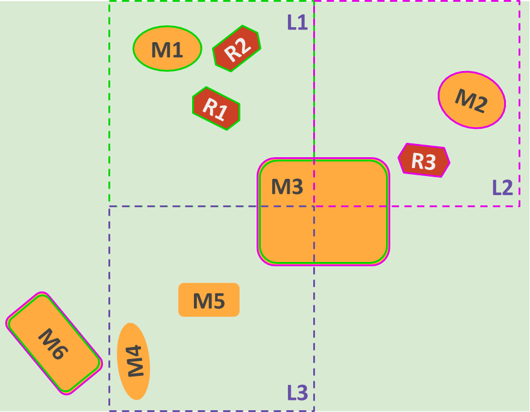
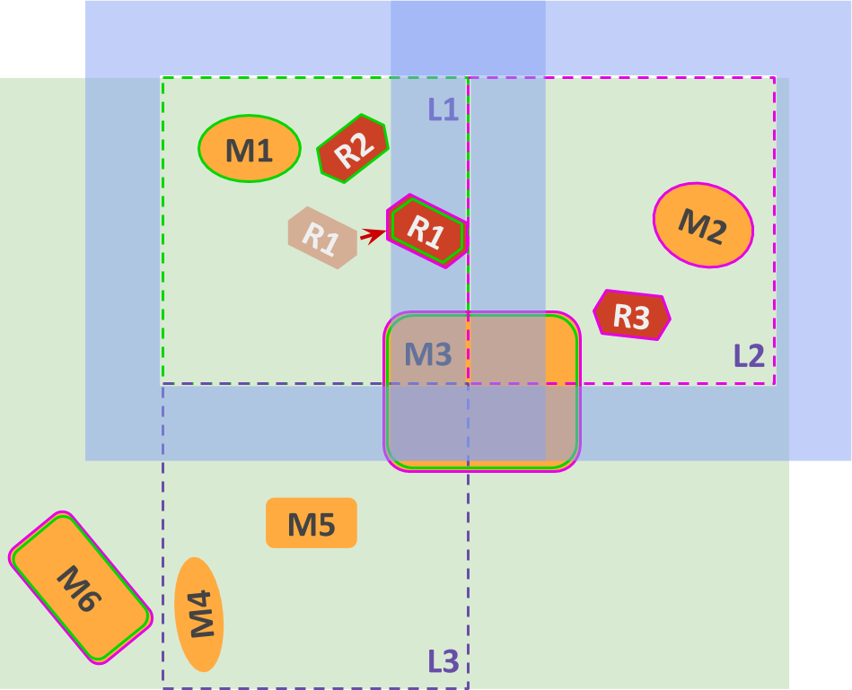
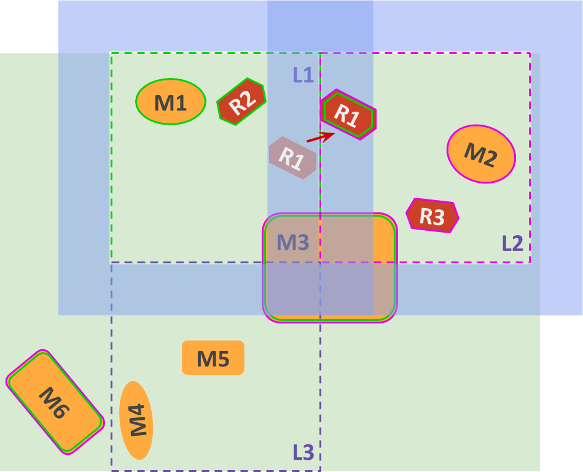

# Gazebo Sim design

> This is an evolving document as design is discussed and iterated on. As features are released,
  the relevant parts of this document should be updated and moved to a tutorial.

## High level behavior

The `Server` loads an SDF file, which may contain multiple worlds, and each
world may be divided into multiple levels.

Ideally, the server should only load the high-level information from the file
such as **worlds**, **levels** and **performers**, but not all entities
immediately, and only load entities according to how simulation is distributed
or which levels are enabled.

> **TODO**: It may be good for performance if the SDFormat library provided a
    way to incrementally load the world, or at least not to create objects in
    memory for everything at once.

### Multiple worlds

> **TODO**: Decide whether to, and how to, support multiple `<world>` tags.

There are use cases for running multiple different worlds in parallel, either in
the same process or different ones.

For these cases, each world could be simulated in a single runner, which will
run all systems and handle all the entities in the world.

In this setup, there's no concept of primary / secondary runners. However, they
will run in lock-step and their data can be collected in a unified manner.

###  Multiple performers, multiple servers

> **This whole section is **

In case there are multiple performers, the simulation will be broken down into:

* 2 or more **secondary simulation runners**, each simulating 1 or more levels;
* 1 **primary simulation** runner, which is responsible for keeping the
  secondaries in sync.

The total number of runners will be predefined through SDF, as well as the
affinity of levels and performers to each runner. Depending on the world
configuration at a given time, some runners may be in stand-by, not performing
simulation, for example, when all performers are physically interacting with
each other.

Let's take a look at the following example.

* There are now 3 performers: `R1`~`R3`

* `R1` and `R2` are both in level `L1`, while `R3` is in `L2`

* The server spins up 3 runners, as described in SDF:
    * The primary runner
    * A secondary runner (`SR1`) with `L1` loaded, together with `R1` and `R2` -
      represented by the bright green outline.
    * A secondary runner (`SR2`) with `L2` loaded, together with `R3` -
      represented by the bright pink outline.

* Note that `M6` is loaded by both secondaries, since it is a global entity.

* During simulation, the primary keeps track of whether performers are
  entering any buffer zones.

Let's say that `R1` does the same movement it did in the example above,
from `L1` to `L3`. In this case, since there are no secondary runners in
stand-by, `SR1` will be simulating both `L1` and `L3`, while `SR2` keeps
simulating just `L2`.

> If, however, the simulation had been started with 3 secondaries and one
of them (`SR3`) was in stand-by, that runner would become responsible for `L3`.

In case `R1` moves towards `L2` however, the following happens:

1. `R1` enters `L2`'s buffer zone

    

1. The primary detects it and forwards `R1`'s current state to `SR2`. At this
time, both `SR1` and `SR2` have `R1` loaded, so `R3`'s sensors can detect `R1`,
but only `SR1`'s physics is acting on `R1`.
1. Once `R1` moves into `L2`, `SR2` takes over its physics simulation, but `SR1`
still keeps track of its state.

    

1. Only once `R1` exits `L1`'s buffer zone it is that `SR1` unloads its
entities.

> **TODO**: How to handle a performer that interacts with other performers in
two different levels at the same time?

> **TODO**: How to decide whether `R1` should be moved to `SR2` or if `L2`
should be loaded into `SR1` together with `L1`? There could be a situation
where `SR2` is already simulating too many levels.

###  Keeping runners in sync

Each secondary runner has its own ECS, with detailed entities loaded. The
primary runner keeps a high-level ECM, which keeps track of which performers are
in which levels and whether they've reached the buffer zone. The server uses
this information to keep performers synced across runners and to make sure each
level and performer is only simulated at one runner at a time.

> **TODO**: Explain how the primary does this

##  Component serialization

> **TODO**: Describe how components will be serialized to be sent across runners
> so their state is synced.

## Standalone programs

It would be convenient to be able to specify standalone programs in the SDF
file so they're loaded at the same time as the simulation. For example,
Gazebo Sim's
[JoyPlugin](https://github.com/osrf/gazebo/blob/gazebo11/plugins/JoyPlugin.hh)
is a `WorldPlugin`, but it doesn't need to access any world API, or to run
in the physics thread, or even to run in the gzserver process. However,
it was implemented as a plugin because that makes it easier to specify in
SDF.

> **TODO**: Describe what this would look like.
