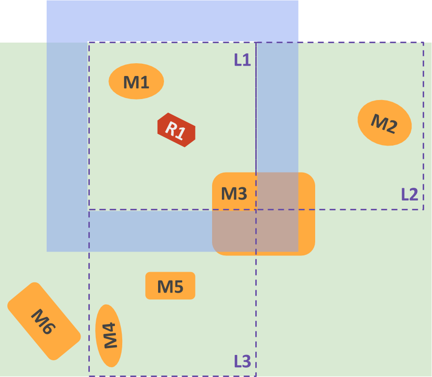
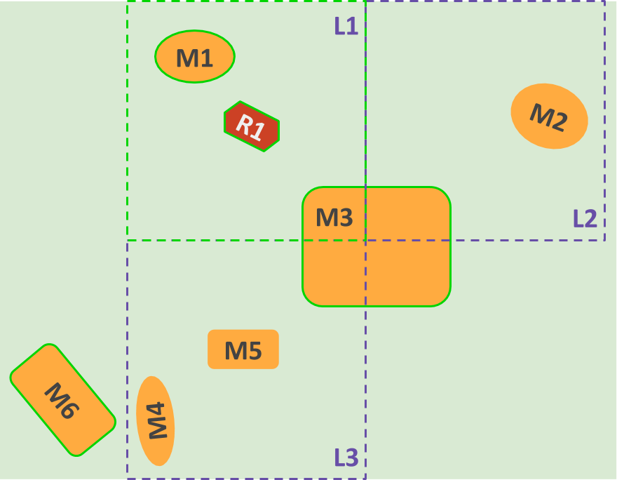
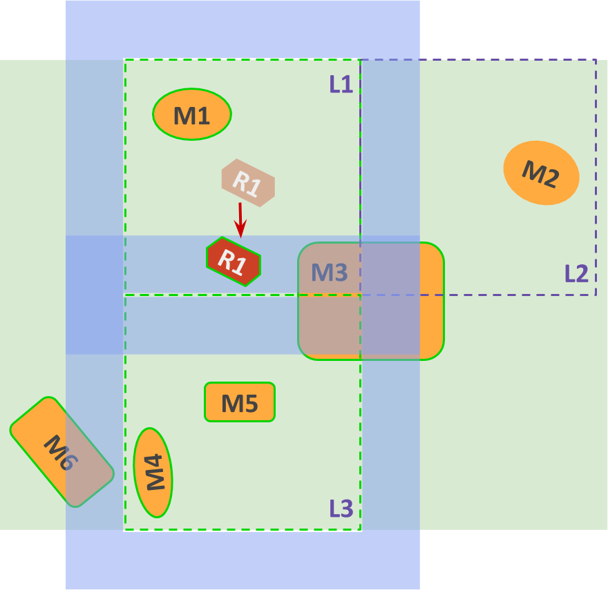
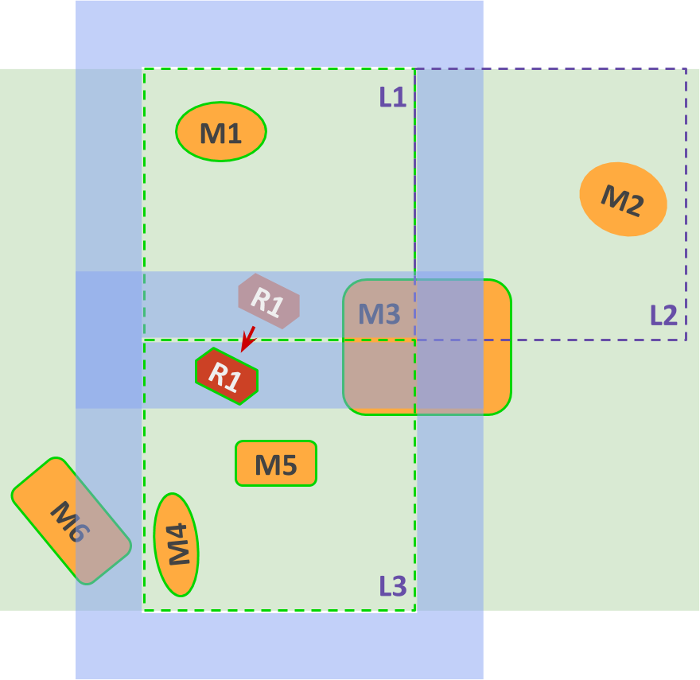
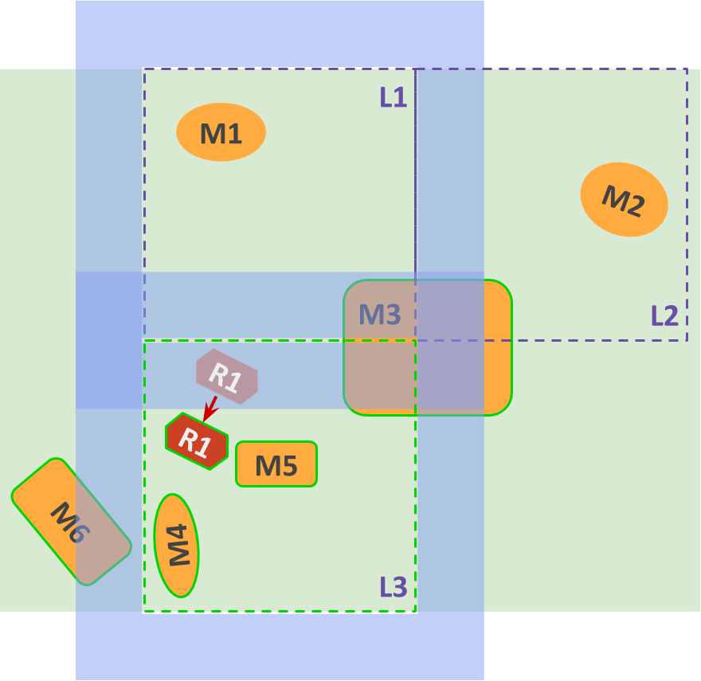

# Ignition Gazebo design

> This is a work in progress, so any details may change. Items marked with  are especially likely to change.

## Goals

* Simulation can be distributed among 1 or more processes
* These processes can be running on the same machine or different ones
* These processes must be kept in sync
* Results can't be interpolated or missed
* We should reduce the amount of duplicate effort across processes

## Terminology

* **World**: The complete description of a simulation, including all robots,
    movable and static objects, plugins, scene and GUIs.

* **Entity**: Every "object" in the world, such as models, links,
    collisions, visuals, lights, joints, etc. An entity is represented by an
    ID, and may have several components attached to it.

* **Component**: Adds a certain functionality or characteristic to an entity.
    For example, pose, name, material, etc.

* **System**: Logic that operates on all entities that have a given set of
    components.

* **Entity-component manager**: **ECM** for short. Manages a set of entities
    and their components.

* **Level**: Part of a world, defined by a box volume and the static entities
    inside it. An entity can be present in more than one level, or in none of
    them. Levels may overlap in their volumes and may be far from each other.

* **Buffer zone**: Each level has a buffer zone, which is an inflation of the
    level's volume outside its boundaries used to detect when a performer
    is about to come into the level, or has left and is far enough away to
    exclude the entity from the level.

* **Simulation runner**: Runs a whole world or some levels of a world, but no
    more than 1 world.
    *  It has a single ECM with all the entities and components
      relevant to the levels / world / performer being simulated.
    * It has an event manager.
    * It loads up a set of systems.
    * Each simulation runner may run in a separate process, or share a process
      with other runners - this is decided at runtime.

*  **Primary / secondary runner**: For each world that is split
    across multiple
    runners, there is exactly one primary simulation runner and one or more
    secondary runners. The **secondary** runners are running a set of levels of
    the world, while the **primary** runner is keeping all secondaries in sync.
    Worlds that are not split across runners don't have a primary runner.

* **Server**: Ignition Gazebo's entry point. It's responsible for loading an
    SDF file and spinning up simulation runners accordingly.

* **Performer**: All simulation entities which may change levels during the
    simulation, such as robots, actors and dynamic models. A performer only
    has meaning if there are levels.

    > An alternative would be that actors and other simple dynamic models are
      handled by the primary runner.

*  **Global entities**: Entities which are present on all levels,
    such as the
    sun, ground plane, heightmaps, etc. These entities will be duplicated
    across all simulation runners.

*  **Default level**: Level which handles all entities that are
    not within
    any other levels, including performers.

* **Event manager**: Manages events that can be sent across systems and the
    server.

## High level behavior

The `Server` loads an SDF file, which may contain multiple worlds, and each
world may be divided into multiple levels.

Ideally, the server should only load the high-level information from the file
such as **worlds**, **levels** and **performers**, since it only needs enough
information to decide how to spin up simulation runners and split up the work
among them. The server shouldn't be concerned about individual entities like
links, visuals, collisions, etc.

> **TODO**: It may be good for performance if the SDFormat library provided a
    way to incrementally load the world, or at least not to create objects in
    memory for everything at once.

### No levels

The simplest case is for worlds without levels or performers. This is
essentially the same as a world with a single level.

For these cases, each world is simulated in a single runner, which will
run all systems and handle all the entities in the world.

In this setup, there's no concept of primary / secondary runners. However, since
worlds are being run in the same server, they will run in lock-step and their
data can be collected in a unified manner.

### Multiple levels, one performer

If a world has a single performer, who may be moving across several levels,
the server spins up a **single runner**, which will initially load only the
level which contains the performer. As the performer moves in the world, the
runner will load / unload levels as needed.

* To "load" a level is to create entities and components for the models in that
level.
* To "unload" a level is to delete entities and components for the models in
that level.
* Systems that keep internal state will need to react appropriately to entities
being added and removed.
* A level is loaded when the performer enters its external buffer zone.
* A level is unloaded when the performer exits its external buffer zone.

Take a look at the 2D example below.



* The **green area** represents the area of the world which this simulation
  is expected to take place in.

* Each of the areas delimited by **dashed purple lines** is a level. There are 3
levels (`L1`~`L3`).

* The **light blue area** represents the buffer zone for level `L1`. Zones
  for `L2` and `L3` have been ommitted.

* Each **orange shape** represents a static model in the world (`M1`~`M6`)

* The **red shape** represents the robot performer (`R1`)

Entities are divided into those that belong to levels, and global entities:

* `M1` belongs to `L1`, so when `L1` is loaded / unloaded, entities will be
  created / destroyed for that model. Likewise, `M2` belongs to `L2`, and `M4`
  and `M5` belong to `L3`.

* `M3` belongs to more than one level.

* `M6` is not in any level, so it is also treated as a **global entity** and is
    always loaded. Ideally, this kind of entity should be avoided unless there's
   a need for it.

Let's take a look at how levels are loaded / unloaded as the performer moves:

1. Performer `R1` starts inside level `L1`. This means that the simulator runner
    will initially have loaded the following, which is represented by bright
    green lines:

    * `R1`, which is the performer.
    * `M1` and `M3`, because they belong to the level.
    * `M6`, because it is global.

    

1. The performer moves south towards `L3` and enters its buffer zone, triggering
  a load of that level's models, `M4` and `M5`. Note that at this moment, both
  `L1` and `L3` are loaded.

    

1. The performer moves further south, exiting `L1` and entering `L3`. However,
  `L1` is still loaded, since `R1` is still within its buffer zone.

    

1. Eventually `R1` moves beyond `L1`'s buffer, triggering an unload of `L1`. The
  main effect is unloading `M1`.

    

###  Multiple performers

> **This whole section is **

In case there are multiple performers, the simulation will be broken down into:

* 2 or more **secondary simulation runners**, each simulating 1 or more levels;
* 1 **primary simulation** runner, which is responsible for keeping the
  secondaries in sync.

The total number of runners will be predefined through SDF, as well as the
affinity of levels and performers to each runner. Depending on the world
configuration at a given time, some runners may be in stand-by, not performing
simulation, for example, when all performers are physically interacting with
each other.

Let's take a look at the following example.


* There are now 3 performers: `R1`~`R3`

* `R1` and `R2` are both in level `L1`, while `R3` is in `L2`

* The server spins up 3 runners, as described in SDF:
    * The primary runner
    * A secondary runner (`SR1`) with `L1` loaded, together with `R1` and `R2` -
      represented by the bright green outline.
    * A secondary runner (`SR2`) with `L2` loaded, together with `R3` -
      represented by the bright pink outline.

* Note that `M6` is loaded by both secondaries, since it is a global entity.

* During simulation, the primary keeps track of whether performers are
  entering any buffer zones.

Let's say that `R1` does the same movement it did in the example above,
from `L1` to `L3`. In this case, since there are no secondary runners in
stand-by, `SR1` will be simulating both `L1` and `L3`, while `SR2` keeps
simulating just `L2`.

> If, however, the simulation had been started with 3 secondaries and one
of them (`SR3`) was in stand-by, that runner would become responsible for `L3`.

In case `R1` moves towards `L2` however, the following happens:

1. `R1` enters `L2`'s buffer zone

    

1. The primary detects it and forwards `R1`'s current state to `SR2`. At this
time, both `SR1` and `SR2` have `R1` loaded, so `R3`'s sensors can detect `R1`,
but only `SR1`'s physics is acting on `R1`.
1. Once `R1` moves into `L2`, `SR2` takes over its physics simulation, but `SR1`
still keeps track of its state.

    

1. Only once `R1` exits `L1`'s buffer zone it is that `SR1` unloads its
entities.

> **TODO**: How to handle a performer that interacts with other performers in
two different levels at the same time?

> **TODO**: How to decide whether `R1` should be moved to `SR2` or if `L2`
should be loaded into `SR1` together with `L1`? There could be a situation
where `SR2` is already simulating too many levels.

## SDF elements

Two new SDF elements are introduced for distributed simulation:

* `<level>`
* `<performer>`

The concepts of levels and performers are specific to ignition gazebo, thus,
putting them directly under the `<world>` tag would diminish the generality of
SDF. A new tag, `<extension>`, has been proposed for such circumstances but has
not been implemented yet. Therefore, for now, the `<level>` and `<performer>`
tags will be added to a `<plugin name="ignition::gazebo" filename="dummy">` tag.
The plugin name `ignition::gazebo` will be fixed so that a simulation runner
would know to check for that name in each plugin tag.

### `<level>`

The `<level>` tag contains information about the volume occupied by the level
and the entities inside the level. The volume is given by a `<box>` geometry
(more shapes may be supported in the future) and it is used to determine whether
a performer is inside the level. Currently, the box shape is internally
converted into an axis aligned box to speed up intersection calculations. The
position of the volume is specified with respect to the world frame using the
`<pose>` tag. Although we are using the `<pose>` tag, the orientation part is
ignored. The `<buffer>` tag is used to express the **Buffer zone** of the
volume.

Entities associated with the level are specified using the `<ref>` tag. The
value of this tag is the name of the entity. A level can contain one or more
`<ref>` tags. Note that it is this tag that determines whether an entity is
considered to be in the level or not. That is, an entity specified by a `<ref>`
would be considered part of a level even if its position is outside the level's
volume. It is up to the user to ensure that all entities specified by the
level's `<ref>` tags are contained within the level's volume.

Example snippet:

```xml
<level name="level1">
  <pose>0 0 5 0 0 0</pose>
  <geometry>
    <box>
      <size>10 10 10</size>
    </box>
  </geometry>
  <buffer>2</buffer>
  <ref>model1</ref>
  <ref>model2</ref>
</level>
```

### `<performer>`

The `<performer>` tag contains a reference to the performer entity (most likely
a model). The `<ref>` tag designates the name of the performer entity. It is
a required tag and there can only be one inside a `<performer>`. Multiple
`<performer>`s cannot point to the same entity.

To simplify the creation of performers, a bounding volume for the performer will
be generated automatically based on the geometries contained in the referenced
model's `<collision>` tags.

Example snippet:

```xml
<performer name="perf1">
  <ref>robot1</ref>
</performer>
```

### Example

The following is a world file that could be an instance of the world shown in
the figure


```xml
<?xml version="1.0" ?>
<sdf version="1.6">
<world name="default">
  <model name="M1">
    <static>1</static>
    <pose>-8 8 0 0 0 0</pose>
    <!-- other links -->
  </model>
  <model name="M2">
    <static>1</static>
    <pose>8 5 0 0 0 0</pose>
    <!-- other links -->
  </model>
  <model name="M3">
    <static>1</static>
    <pose>0 0 0 0 0 0</pose>
    <!-- other links -->
  </model>
  <model name="M4">
    <static>1</static>
    <pose>-8 -8 0 0 0 0</pose>
    <!-- other links -->
  </model>
  <model name="M5">
    <static>1</static>
    <pose>-5 -5 0 0 0 0</pose>
    <!-- other links -->
  </model>
  <model name="M6">
    <static>1</static>
    <pose>-12 -8 0 0 0 0</pose>
    <!-- other links -->
  </model>

  <model name="R1">
    <pose>-5 5 0 0 0 0</pose>
    <!-- other links and joints-->
  </model>
  <model name="R2">
    <pose>-5 8 0 0 0 0</pose>
    <!-- other links and joints-->
  </model>
  <model name="R3">
    <pose>5 2 0 0 0 0</pose>
    <!-- other links and joints-->
  </model>

  <plugin name="ignition::gazebo" filename="dummy">
    <performer name="perf1">
      <ref>R1</ref>
    </performer>
    <performer name="perf2">
      <ref>R2</ref>
    </performer>
    <performer name="perf3">
      <ref>R3</ref>
    </performer>

    <level name="L1">
      <pose>-5 5 5 0 0 0</pose>
      <geometry>
        <box>
          <size>10 10 10</size>
        </box>
      </geometry>
      <buffer>2</buffer>
      <ref>M1</ref>
      <ref>M3</ref>
    </level>
    <level name="L2">
      <pose>5 5 5 0 0 0</pose>
      <geometry>
        <box>
          <size>10 10 10</size>
        </box>
      </geometry>
      <buffer>2</buffer>
      <ref>M2</ref>
      <ref>M3</ref>
    </level>
    <level name="L3">
      <pose>-5 -5 5 0 0 0</pose>
      <geometry>
        <box>
          <size>10 10 10</size>
        </box>
      </geometry>
      <buffer>2</buffer>
      <ref>M3</ref>
      <ref>M4</ref>
      <ref>M5</ref>
    </level>
  </plugin>
</world>
</sdf>
```

###  Keeping runners in sync

Each secondary runner has its own ECS, with detailed entities loaded. The
primary runner keeps a high-level ECM, which keeps track of which performers are
in which levels and whether they've reached the buffer zone. The server uses
this information to keep performers synced across runners and to make sure each
level and performer is only simulated at one runner at a time.

> **TODO**: Explain how the primary does this

##  Component serialization

> **TODO**: Describe how components will be serialized to be sent across runners
> so their state is synced.

