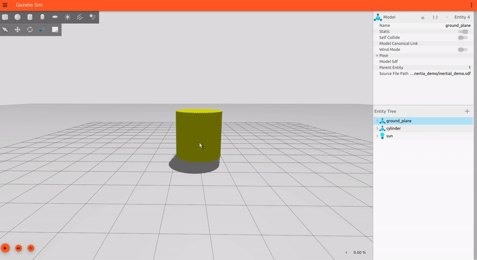
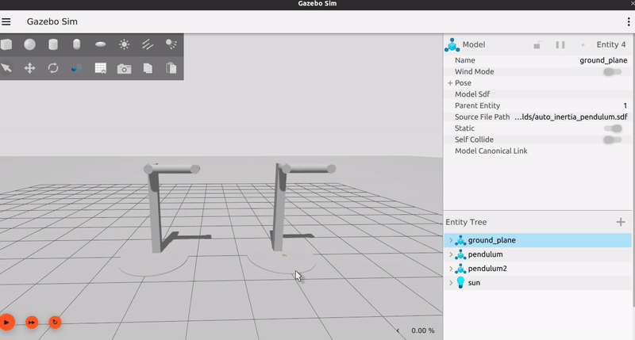
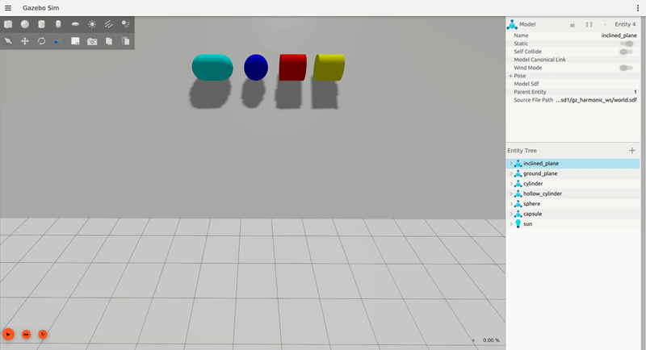

\page auto_inertia_calculation Automatic Inertia Calculation for Links

## Automatic Inertia Calculation for SDFormat Links

This feature enables automatic calculation for the Moments of Inertia, Mass, and
Inertial Pose (Center of Mass pose) of a link described using SDFormat. The following
geometry types are currently supported for this feature:
 * Box
 * Capsule
 * Cylinder
 * Ellipsoid
 * Sphere
 * Mesh

Using this feature, a user can easily set up an accurate simulation with physically
plausible inertial values for a link. This also removes the dependency on manual calculations
or 3rd-party mesh processing software which can help lower the barrier of entry for beginners.

This tutorial will focus on how this feature can be enabled and how the
inertia values for a link can be configured. Some limitations and recommendations
would also be discussed along the way that would allow users to more mindfully utilize this feature.

## Basic Overview

This feature introduced a new `auto` attribute for the `<inertial>` tag which can be set
 to enable or disable the automatic calculations. It'll be set to false by default.

```xml
<inertial auto="true" />
```

In case, `auto` is set to true, the constituent **collision geometries** of the link are
considered for the calculations. The `<density>` tag can be used to specify
the mass density value of the collision in kg/m^3. The density of water (1000 kg/m^3) is
utilized as the default value:

```xml
<collision name="collision">
  <density>2710.0</density>
  <geometry>
    <box>
      <size>1 1 1</size>
    </box>
  </geometry>
</collision>
```

In case of multiple collision geometries in a link, a user is free to provide different
density values for each and the inertia values from each would be aggregated to calculate
the final inertia of the link. However, if there are no collisions present,
an `ELEMENT_MISSING` error would be thrown.

It is **important** to note here that if `auto` is set to `true` and the user has
still provided values through the `<mass>`, `<pose>` and `<inertia>` tags, they
would be **overwritten** by the automatically computed values.

> **Note:** Use SDF Spec version 1.11 or greater to utilize the new tags and attributes of this feature.

Here's an example snippet of a cylinder model that has automatic inertial calculations
enabled and has a density of 1240 kg/m^3:

```xml
  <model name="cylinder">
    <link name="cylinder_link">
      <inertial auto="true" />
      <collision name="collision">
        <density>1240.0</density>
        <geometry>
          <cylinder>
            <radius>1</radius>
            <length>2</length>
          </cylinder>
        </geometry>
      </collision>
      <visual name="visual">
        <geometry>
          <cylinder>
            <radius>1</radius>
            <length>2</length>
          </cylinder>
        </geometry>
        <material>
          <diffuse>1.0 1.0 0.0 1.0</diffuse>
          <ambient>1.0 1.0 0.0 1.0</ambient>
          <specular>1.0 1.0 0.0 1.0</specular>
        </material>
      </visual>
    </link>
  </model>
```

If you use the above snippet in an empty world and launch it with `gz-sim`, here's
how it would look:



## Links with Multiple Collisions & the Effect of Density

To understand the inertia calculation in links with multiple collisions and the
effect of setting different density values, you can launch the `auto_inertia_pendulum.sdf`
example world using:

```bash
gz sim auto_inertia_pendulum.sdf
```

After the gz-sim window opens up, you can right click on both the models and enable
the centre of mass visualization by selecting the `View > Center of Mass` option from
the menu. Once you play the simulation it should look this:



This example world has two structurally indentical models. The pendulum link of both
the models contain 3 cylindrical collision geometries:
 - One on the top which forms the joint (pivot)
 - A longer cylinder in middle
 - One at the end which forms the bob of the cylinder.

Even, though they are identical, the center of mass for both are different
as they use different density values for the different cylinder collisions. On one
hand, the upper joint collision of the pendulum on the left has the highest density
which causes the center of mass to shift closer to the axis. While on the other hand,
the bob collision of the pendulum on the right has the highest density which causes
the center of mass to shift towards the end of the pendulum.
This difference in mass distribution about the axis of rotation results in a difference
in the moment of inertia of the 2 setups and hence different angular velocities.

## Mesh Inertia Calculation with Rolling Shapes Demo

Let's try another example world, `auto_inertia_rolling_shapes.sdf`. This can be
launched with `gz sim` using the following command:

```bash
gz sim auto_inertia_rolling_shapes.sdf
```

Once you launch and play the simulation, it should look something like this:



Here the right most shapes is a hollow cylinder (yellow). This model is loaded from
[Gazebo Fuel](https://app.gazebosim.org/jasmeetsingh/fuel/models/Hollow%20Cylinder)
and is made using a collada mesh of a hollow cylinder. Apart from this, we can
see there is a solid cylinder, a solid sphere and a solid capsule. All of these are
made using the `<geometry>` tag and have automatic inertia calculations enabled.
Here, the moments of inertia for the hollow cylinder (which is a non-convex mesh shape) is
calculated and from the simulation we can see that it reaches the bottom of the
incline last. This is physically accurate as the mass distribution for the hollow
cylinder is concentrated at a distance from the axis of rotation (which passes through
the center of mass in this case).

## Key Points on Mesh Inertia Calculator

Here are some key points to consider when using automatic inertia calculation with 3D Meshes:
 * Water-tight triangle meshes are required for the Mesh Inertia Calculator.
 * Since the vertex data is used for inertia calculations, high vertex count would be
 needed for near ideal values. However, it is recommended to use basic shapes with the
 geometry tag (Box, Capsule, Cylinder, Ellipsoid and Sphere) as collision geometries get
 a better overall simulation performance or RTF.
 * Currently, the mesh inertia calculator does not work well with meshes having submeshes.
 Therefore, they are not recommended for automatic computation.
