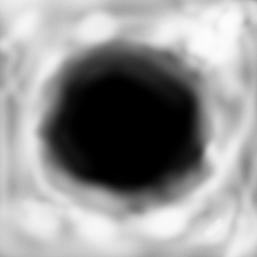
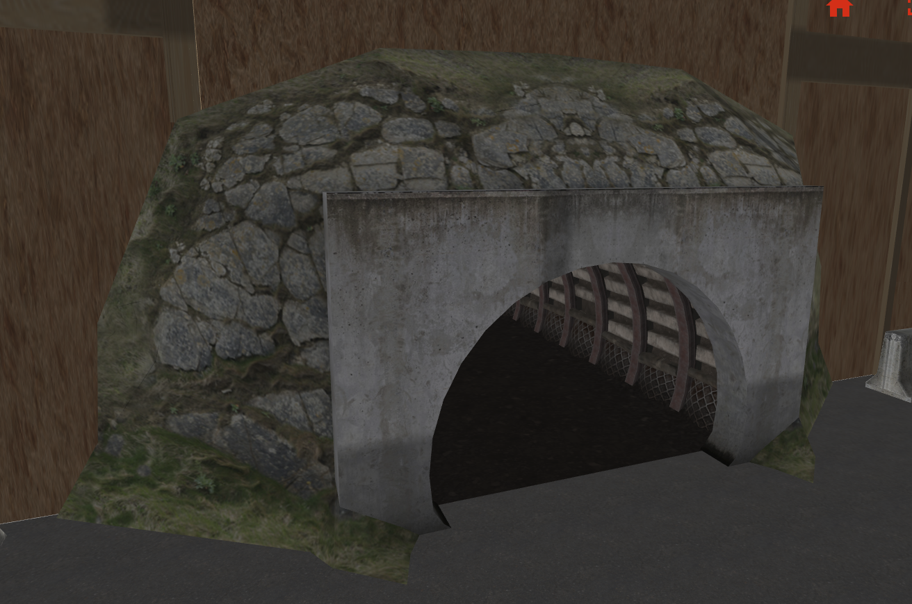

# Overview

## What are heightmaps and why are they useful for simulation?

Simply put, a heightmap is a 2D image where the value of each pixel or cell corresponds to the elevation or height of that specific point in the real world.


Image reference: https://www.futurelearn.com/info/courses/advanced-archaeological-remote-sensing/0/steps/356833

They are useful for simulation because they offer a simple way to provide realistic digital representation of the terrain.
For fields like robotics, accurate topography can be beneficial for develop algorithms and/or models for autonomous navigation, motion planning, task planning, and control because they can provide cost effective, rapid development cycles.
Engineers can develop and test algorithms in these environments before physical deployment.

In this tutorial we'll dive deeper into what makes heightmaps, where to get them, and how to process them to use for simulation in modern Gazebo.

## Gazebo's supported heightmap types

Modern Gazebo supports image heightmaps, meshes, and Digital Elevation Models (DEMs).
While this tutorial will be focusing more in depth with DEMs, we will provide a quick overview of the other formats available to try out.

### Image heightmaps

Image heightmaps use a 2D grayscale image, where each pixel coresponds to the elevation at that point. Black (or `0`) represents the lowest point and while (or `255`) represents the highest.
This is a simple and efficient way to store elevation data because less memory compared to meshes and DEMs.

The following example will look at the [demo created for Gazebo Fortress](https://app.gazebosim.org/OpenRobotics/fuel/models/Fortress%20heightmap). Below shows the black and white image is what gets referenced in SDF and fed into Gazebo (download the model from the previous link and look at the `model.sdf` file).



What ends up getting rendered in Gazebo is shown below:


### Meshes

Another format used for realistic topography are meshes, which are 3D polygonal models.
The supported file formats for meshes in Gazebo are DAE, FBX, GLTF, OBJ, and STL.
These models are best suited for worlds with tunnels, caves, or overhangs.




Meshes were the format used for the [Darpa Subterranean Challenge (SubT) simulation](https://github.com/osrf/subt/wiki)
and most were created from point cloud converted data (check out this [tutorial on how to convert point cloud data to a 3D mesh model for Gazebo](http://gazebosim.org/api/sim/10/pointcloud.html)). 
These heightmap meshes can be found [here on fuel](https://app.gazebosim.org/OpenRobotics/fuel/collections/SubT%20Tech%20Repo).

### Digital Elevation Models

A Digital Elevation Model (DEM) is a 3D representation of a terrain's surface that does not include any objects like buildings or vegetation.
DEMs are frequently created by using a combination of sensors, such as satellites, LIDAR, radar, or cameras.
The terrain elevations for ground positions are sampled at regularly-spaced horizontal intervals.


<!-- TODO figure out better title -->
# Walkthrough with DEMs for Gazebo

There are two main types of DEM formats, a vector-based Triangular Irregular Network (TIN) or a grid of elevations (raster).
In Gazebo, maintainers have only tested raster based formats (more specifically GeoTiff or `.tif` files) but in theory Gazebo should be able to run any [GDAL](https://gdal.org/en/stable/index.html) default supported format
(since GDAL is the backend library that Gazebo uses to read DEM files).
Let's look at an example of getting DEMs from publically available data and using some common open source tools to them for Gazebo.

## Obtaining data

Many resources for publically available data exist and include:

* [OpenTopography](https://portal.opentopography.org/datasets)
* [earthexplorer.usgs.gov](http://earthexplorer.usgs.gov)
* [NASA's EarthData](https://www.earthdata.nasa.gov/topics/land-surface/digital-elevation-terrain-model-dem/data-access-tools)
* [General Bathymetric Chart of the Oceans (GEBCO) data](https://www.gebco.net/)
* [Other planetary DEMs (e.g., Moon or Mars)](https://astrogeology.usgs.gov/search?target=&system=&p=1&accscope=&searchBar=)

For our example, we will use [OpenTopography](https://portal.opentopography.org/datasets),
* Create an account if not done so already
* Look for your area of interest, in this example, in the "Search by keyword" textbox enter `half dome`
* In the results section, under "High Resolution Topography" click "Get Raster Data"
* In the following page,

  * In the map, click the blue "Select a Region" button in the top left corner of the map to select the region to extract the DEM from
  
  * The data output format should be GeoTiff and Digital Terrain Model (DTM) should be checked for Layer types
  * Click Submit

* Once the data has finished processing, download the bundled results and upzip the file

## Processing data

Common open source tools for geospatial data include:

* [Geospatial Data Abstraction Library (GDAL)](https://gdal.org/en/stable/): is a library and command line toolkit for reading and maipulating DEMs.
This is the library that is used in Gazebo for reading DEMs and will be instelld on your system if Gazebo is installed.
* [QGIS](https://qgis.org/): a GUI for viewing, analyzing, editing, and publishing DEMs and relies on GDAL.

Using [QGIS](https://qgis.org/),

* (optional) When working with earth DEMs, it can be helpful to add a Google Satellite layer (as the base layer) to verify the imported DEM is in the correct projection.

  * In the top toolbar, go to Layer > Add Layer > Add XYZ Connection...
  * In the dropdown, select Google Satellite > Click 'Add' > then 'Close'

* In the top toolbar, go to Layer > Add Layer > Add Raster Layer...
* Select the file that we downloaded and unzipped (from the instructions above) > Click 'Add' > then 'Close'
* In the bottom bar, update "Scale" to `1:50000` and in the "Coordinate" textbot, enter the lat/lon coordinates retrieved from USGS earlier (i.e., `37.7444°, -119.5341°`) > hit the Enter key (this will move the viewpoint to the desired location)

  * If the optional step was followed, QGIS should look something like the image below, otherwise only the DEM will be displayed


* If the Processing Toolbox panel isn't open, click the gear icon in the top toolbar

  * Search for "Clip raster by extent" and double click to open the dialog
  * Input layer: should be the imported geotif
  * Clipping extent: click the down arrow and select "Draw on Map Canvas" to select your desired region

  

  * Clipped (extent): Click the button with the "..." dots > Save to File ... > select the desired save location and give the file a name
  * Click the "Run" button, this will add a new layer to the layers panel (on the left)

## SDF setup

Now let's set up the SDF model, in a terminal run: `gdalinfo -stats <newly_saved.tif>`

Look for the output: `Size is <x_value> <y_value>`

This is the `x` and `y` values that need to be entered in the `<size>` tag. To calculate z, subtract the `Minimum` from the `Maximum` elevation (i.e., `z = Maximum - Minimum`).

Optionally, to move the model down to Gazebo's camera default viewpoint, update the `z` of the `<pos>` tag to be the negative of the `Maximum` elevation (i.e., `<pos>0 0 -Maximum</pos>`). Note when using seabed data (e.g., GEBCO), negate the `Minimum` instead.

The model should look similar to the following:

```xml
<model name="half_dome">
  <static>true</static>
  <link name="link">
      <collision name="collision">
          <geometry>
              <heightmap>
                  <uri>half_dome.tif</uri>
                  <!-- gdalinfo -stats <dem_file> -->
                  <size>3793 3563 1481.398</size>
                  <pos>0 0 -2694.987</pos> <!-- -(max or min elevation) -->
              </heightmap>
          </geometry>
      </collision>
      <visual name="visual">
          <geometry>
              <heightmap>
                  <use_terrain_paging>false</use_terrain_paging>
                  <texture>
                      <diffuse>materials/textures/rocks_diffuse.png</diffuse>
                      <normal>materials/textures/rocks_normal.png</normal>
                      <size>250</size>
                  </texture>
                  <blend>
                      <min_height>2</min_height>
                      <fade_dist>5</fade_dist>
                  </blend>
                  <blend>
                      <min_height>4</min_height>
                      <fade_dist>5</fade_dist>
                  </blend>
                  <uri>half_dome.tif</uri>
                  <!-- gdalinfo -stats <dem_file> -->
                  <size>3793 3563 1481.398</size>
                  <pos>0 0 -2694.987</pos> <!-- -(min or max elevation) -->
              </heightmap>
          </geometry>
      </visual>
  </link>
</model>
```

Launch Gazebo and it should look something like this:


To see the completed demo, [download here](files/digital_elevation_models/half_dome_example/).


