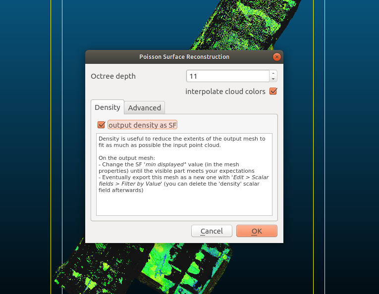

# Converting a Point Cloud to a 3D Model

In this tutorial, you will learn how to convert a point cloud to a 3D model using the open source software CloudCompare.
This skill will allow you to turn raw point cloud data into mesh files you can import to Ignition Gazebo and use in your simulations.

## Prerequisites

First, you’ll need to have a point cloud already imported.
You can download the point cloud used in this tutorial [here](https://www.dropbox.com/sh/zg97h5e8e7enya4/AADh1IArhXT2_BbS7z8GeBNza?dl=0).

Next, you’ll need to download CloudCompare.
This is the software we will be using to convert our point cloud to a mesh.
CloudCompare is free and open source.
You can download it [here](http://www.danielgm.net/cc/release/).

## Converting with CloudCompare

After installing, open CloudCompare and import your point cloud file by going to `File` > `Open`.
Depending on the number of points in your point cloud, this could take several minutes.

<!-- maybe instead have a screen here of what the screen looks like after importing?
like "You should see the following:" -->

Many 3D scans will be composed of millions, sometimes hundreds of millions of points.
Converting our scan to a 3D model with that many points will be very difficult due to the number of polygons that would be created and the long processing time necessary to compute the normals.

To solve this, we need to reduce the number of points to something that will be easier for the software to convert and give us a 3D model with a polygon count that will be able to be loaded into other software.

### Reduce Points

To reduce the number of points in your cloud go to `Edit` > `Subsample`

The number you will need to enter in the `min. space between points` field will vary depending on your point cloud.
A value of .01 was sufficient to bring our point cloud to a more reasonable 12 million points.
How many points you reduce down to will largely depend on how long you are willing to wait for the point cloud to be converted into a mesh.
The more points you start with, the longer it will take to compute the normals and create the mesh.

After the operation is complete you’ll have two clouds in your scene: the original point cloud and your subsampled point cloud.
Most operations in CloudCompare will create new point clouds and keep the original, so make sure that you have the new point cloud selected before running an operation.

### Create a Polygonal Mesh

Now we have a point cloud with 12 million points instead of 94 million points.
However, right now our point cloud is just a bunch of points in space.
In order to create a polygonal mesh from this point cloud we will need to compute the normals.
A normal is essentially the direction a polygon is facing.
To do this, go to `Normals` > `Compute`.
You'll see this dialog box:

You’ll see various options in the dialog box that appears.
The main thing you’ll want to consider is what `Local surface model` to use.
`Plane` is good with noise but not very good with sharp edges.
`Triangulation` is the opposite: it is good with sharp edges but not noise.
`Quadric` is good for smooth, curvy surfaces.
In our case, we want to keep some of the jaggedness of the rocky surfaces in our tunnel so we’re going to go with the `Triangulation` surface model.

Now we get to actually convert our point cloud to a mesh.
To do this go to `Plugins` > `PoissonRecon`.
You'll see this dialog box:

The value you enter in the `Octree depth` field will determine the polygon count of the created model.
You may have to run the surface reconstruction a couple times with varying values before you land on a polygon count that is suitable for your needs.
The “right” polygon count will be determined by how the object will be used in a scene.
Environments will likely be over a million polygons while individual objects should be a few thousand.

We’ll also want to make sure we check the box for `output density as SF`.
This will create a scalar field for us which will be useful in the next step.

### Trim Excess Polygons

Our mesh has now been created.
A value of 11 has given us 1.7 million faces.
We have a problem however.
Our tunnels have turned into a blob shape.
This is because the mesh that CloudCompare creates will always be water tight even if it has to add polygons where there are no points.
We just want our tunnels, though, so we need to remove those unnecessary polygons.

This is where our scalar field comes in.
In the lower left go to `SF display params` and take the left handle in the graph and drag it to the right until it hits the area where the bulk of the scalar field starts.

<!-- make this a gif ^ of dragging to the right position -->

This will display only the polygons that were created from the point cloud and hide the polygons used to make the model watertight.
The polygons are only hidden however.
We still need to actually remove them.

To remove the hidden polygons go to `Edit` > `Scalar field` > `Filter By Value`.

A dialog box will appear with the `Range` values automatically entered based on what we entered in our `SF display params`.
Hitting `Split` will create two meshes.
One with the polygons inside our specified range and one containing polygons outside that range.
Hitting export will simply export the mesh within that range.

### The Completed Model

By hitting `Split` we can view the model before exporting by simply going to `File` > `Save`.
Remember to have the correct mesh selected since choosing `Split` will give you two new meshes, plus you will still have your original, complete mesh.
Your file format will depend on the software you want to use but `.obj` is a widely supported format that should work in most 3D applications.

You can find more information on CloudCompare and a more in depth look at the tools we used in this tutorial on [the CloudCompare website](https://www.cloudcompare.org/) and the [CloudCompare wiki](https://www.cloudcompare.org/doc/wiki/index.php?title=Main_Page).

<!--

## Next Up

Learn how to import your mesh into Ignition Gazebo, either by importing your mesh to Fuel, or writing an SDF file.

(add link to importing mesh to fuel (which i'll be writing next)? or to SDF?)

-->
