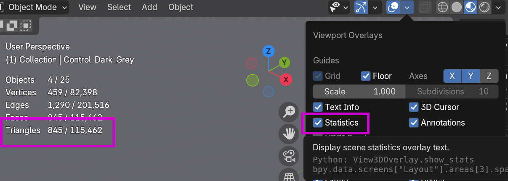
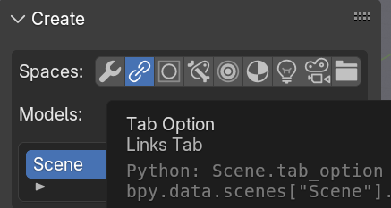
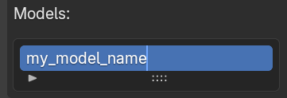
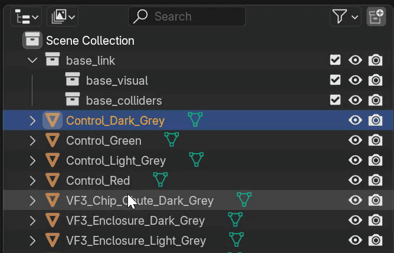
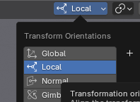
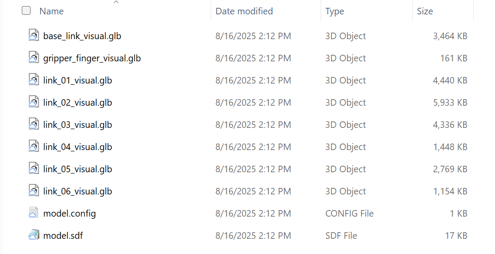

### **Tutorial: From CAD to a Simulation-Ready SDF Model**

### **Section 1: Introduction and SDF Overview**

This guide explains how to convert a 3D model from CAD software (e.g., SolidWorks, Fusion 360, Inventor) into an SDF (Simulation Description Format) file ready for import into Gazebo. 

**What is an SDF file?** SDF is an XML file format that describes all aspects of a simulation, including robots, lights, sensors, and the environment. Think of it as a blueprint for a virtual world. It's a core component of the Gazebo robotics simulator.

Here's how you'd typically author an SDF file:

* **Use a Plain Text Editor:** As SDF files are XML, any text editor (e.g., VS Code, Sublime Text, Notepad) can be used. Plugins for many editors offer XML syntax highlighting.  
* **Start with SDF Tags:** Every SDF file begins and ends with \<sdf\> tags, where you specify the SDF format version.  
* **Define a Model:** Inside the \<sdf\> tags, define a \<model\> to represent your robot, furniture, or any simulation object.  
* **Add Links and Joints:** A robot model consists of links (rigid parts) and joints (connecting links and enabling movement). Define each of these.  
* **Define Visual and Collision Properties:** For each link, specify a \<visual\> tag (appearance) and a \<collision\> tag (physical shape for interactions).  
* **Add Sensors and Plugins:** Incorporate sensors (e.g., cameras, IMUs) and plugins to control your model's behavior.

For more details on SDF, refer to:  [http://sdformat.org/spec?ver=1.12\&elem=sdf](http://sdformat.org/spec?ver=1.12&elem=sdf) 

---

### **Section 2:  Simplify your CAD model** 

Follow these steps to optimize your CAD model, ensuring it's clean, efficient, and ready for use in real-time applications like simulators or renderers.

#### **Step 1: Assign and Consolidate Materials 🎨**

Before you export, it’s crucial to organize your model's materials. The goal is efficiency, not perfect physical accuracy.

* **Assign Materials:** Make sure every part of your model has a material assigned to it.  
* **Consolidate Materials:** This is the most important part. All parts that look the same should share the **exact same material**. For instance:  
  * If you have ten bare aluminum parts, they should all use a single "Bare Aluminum" material.  
  * If you have five anodized green parts, they should all use a single "Anodized Green" material.

Avoid creating copies of materials (e.g., "Aluminum-1," "Aluminum-2"). Using a single material for identical surfaces significantly improves performance in the final application.

### ---

#### **Step 2: Optimize Your Model's Geometry ✂️**

To ensure your model runs smoothly, you need to remove any unnecessary geometry. A lower polygon count leads to smaller file sizes and better performance.

* **Remove Hidden Parts:** Delete all internal components that are never visible from the outside, as they are not needed and impact performance in Gazebo.  
* **Remove Insignificant Details:** Eliminate small parts that don't add significant visual value (e.g., **bolts, screws, internal threads, rivets**). This leads to faster uploads and more optimal calculations.

### ---

#### **Step 3: Convert Your Model to a Mesh**

Your solid CAD model needs to be converted into a surface mesh made of polygons (triangles). This process is often called **tessellation**.

* **Manual Conversion:** It's best to manually convert your model to a mesh within your CAD software. This gives you control over the final quality and polygon count.  
* **Adjust Settings by Part:** For large assemblies, don't use a single conversion setting for everything. A large, simple panel doesn't need the same mesh density as a small, complex part. Convert different parts with different settings to get the best results.  
* **Follow Polycount Guidelines:** "Polycount" refers to the number of triangles ("tris") in your mesh. Aim for these general targets to maintain good performance:  
  * **Small Parts** (fittings, adapter plates): **\< 10,000 tris**  
  * **Medium Parts** (sensors, grippers): **\< 25,000 tris**  
  * **Large Parts** (robot arms, major components): **\< 100,000 tris**  
  * **Very Large Parts** (enclosures, machine frames): **\< 200,000 tris**

### ---

#### **Step 4: Export the Final Mesh 📤**

Once your model is optimized and converted, you're ready to export it. The file format you choose matters.

* **Export as a Mesh:** Use your CAD software’s `Export` or `Save As` function and choose a mesh file format.  
* **Choose the Best Format:** Select the most ideal format that your CAD software supports, following this order of preference:  
  1. **GLB (.glb):** **(Most Ideal)** This format is effective because it can bundle everything—the mesh, materials, and textures—into a single file.  
  2. **FBX (.fbx):** A very common and robust format in the 3D industry that handles mesh and material data well.  
  3. **OBJ (.obj):** A widely supported and reliable format, though it may handle materials less gracefully than GLB or FBX.  
  4. **STL (.stl):** **(Least Ideal)** Use this only as a last resort. It typically contains only raw geometry data and no material or color information.

Note at this point, if your object does not have any kinematics, you can directly import the object. If you want to further refine parts, we recommend following the  mesh refinement instructions  in Blender. 

If you are satisfied with the mesh refinement and want to upload a file with Kinematics you may do so by authoring and SDF manually. See the [Creating an SDF manually](#section-4:-manual-sdf-file-creation) section

If you would like to use the Blender plugin to automatically author the SDF,  follow the steps below.   
---

### **Section 3:  Using Blender for Mesh Optimization and SDF Generation**

This section explains how to use the custom SDF gen plugin to author the SDF and perform additional mesh simplification steps if needed. 

####  **Section 3: Part 1 \- Initial Setup & Model Preparation**

Follow these steps to install the required addon and prepare your mesh geometry for the SDF generation process.

##### **Step 1: Addition of the plugin to Blender⚙️**

  Following steps show how to activate the SDF format add-on inside Blender.

1. **Download the Repository:** First, you need to download the plugin and add it to Blender. The repository can be found here \- [https://github.com/cole-bsmr/SDF\_Gen](https://github.com/cole-bsmr/SDF_Gen) .  
2. In Blender, **Open Preferences**: In the top menu bar, click `Edit` \> `Preferences`.  
3. **Go to Add-ons**: In the new window, select the `Add-ons` section from the left-hand menu.  
4. Click on **“Install from Disk”** and search for the file to upload it.   
5. **Enable the Add-on**: The "Import-Export: SDF format" add-on will appear. Click the checkbox next to it to enable it.  
6. **Close Preferences**: The change is saved automatically. You can now close the Preferences window.


##### **Step 2: Install the STEPper Addon 🔌** 

This addon is required to properly process CAD files.

* After installing SDF\_Gen, a link to purchase and install the STEPper addon will appear in the Utilities tab within the Plugins tab, if it is not already installed ([https://ambient.gumroad.com/l/stepper](https://ambient.gumroad.com/l/stepper)).
* This addon is just to import STEP files into Blender. If you have an .obj, stl, or .DAE file, for example, you're good to go.
* Do not share the STEPper addon files. Each user must purchase their own license. Installation follows the same process as the SDF\_Gen addon.

##### **Step 3: Clean Your Mesh 🧹** 

This action prepares the model’s geometry to work correctly with the addon by applying transforms and separating object data.

* Select all the objects you want to clean (shortcut: "a" for all).  
* In the Utilities tab, press the Clean Mesh button. You will notice the object hierarchy in the outliner is removed.  
* Pro-Tip: If you need the original hierarchy to help organize your links, select only the objects for a single link and press Clean Mesh. Repeat this process for each group of objects that will form a link.

##### **Step 4: Optimize Your Geometry 📉** 

For better performance, check and reduce your model’s polygon count.

* **Examine Polygon Count:** In the Overlay menu at the top of the viewport, turn on Statistics. Focus on keeping the Triangles count as low as possible. If it's too high, either simplify the model in your CAD software and re-export, or use the decimation tools.



* **Decimate Small Parts:** Select an object to optimize. In the SDF\_Gen addon panel, find the Visual Properties section and select Decimate Mesh. Use the slider to lower the polygon count. If the mesh breaks or looks distorted, try using the Merge Vertices or Smooth Mesh buttons to fix visual artifacts. (Refer \- [Select Small Parts](https://github.com/cole-bsmr/SDF_Gen?tab=readme-ov-file#select-small-parts))

#### ---

#### **Section 3: Part 2 \- Building the SDF Model**

This section covers the core workflow of defining the links, colliders, and joints for your model.

##### **Step 1: Create Links 🔗** 

Links are the individual rigid bodies of your model.

* Navigate to the Links tab in the SDF\_Gen addon.  
*   
* In the ‘Models:’ window, rename "Scene" to your desired model name. This will also be the name of the export folder.  
*   
* Press the Create Link button and enter a name. Note that "\_link" will be automatically added to the end.  
* In the Outliner, drag the mesh objects that belong to this link into the link's "visual" collection.  
*   
* When a link is selected, you can check the Static box in its properties to control whether it will be static or dynamic in the final SDF file.  
* All links will be displayed in the “Links List” section.  
  

##### **Step 2: Create Colliders 📦**

Colliders define the physical shape of a link for simulation. Primitive colliders are highly recommended over mesh colliders for performance.

* **Create Primitive Colliders:**   
  * Select one or more visual objects and press the Box, Cylinder, Sphere, Cone, or Plane button to generate a corresponding collider.   
  * Use the Last Operation Panel in the lower-left of the viewport to adjust the fit before clicking elsewhere.  
  * See how these settings affect the creation of colliders [here](https://github.com/cole-bsmr/SDF_Gen?tab=readme-ov-file#operation-panel).  
* **Create Mesh Colliders:**   
  * If absolutely necessary, use the Mesh Collider button. Be sure to use the available tools to reduce the mesh resolution as much as possible to maintain performance.  
  * See more about creating mesh colliders [here](https://github.com/cole-bsmr/SDF_Gen?tab=readme-ov-file#mesh-collider). Specifically note the tools to reduce the resolution of the mesh collider as this will have a large effect on performance.  
* **Transform Colliders:**   
  * Use the ‘Scale Cage’ tool combined with the ‘Face Snap’ tool to quickly and precisely adjust the size and fit of primitive colliders to the underlying geometry.   
  * You can also use the Global Margin setting to adjust the distance between all colliders and the geometry.  
  * 

##### **Step 3: Create Joints ⚙️** 

Joints define how links connect and move relative to each other.

* Switch to the ‘Joints’ tab and press ‘Create Armature’ to prepare the scene.  
* Press the ‘Create Joint’ button, then choose your joint type and the child link. The child link cannot be changed later, so you will need to delete and recreate the joint if you make a mistake.  
* Always use the ‘Delete Joint’ button in the SDF\_Gen menu to remove joints.  
* Press the ‘Adjust Joints’ button to move the joint to its correct location without affecting the model's geometry.  
  * Use either the move/rotate gizmo, or the transform panel under the “Adjust Joints” button.  
  *   
* In the ‘Joint Properties’ Panel, set the parent link and any applicable joint limits. For a revolute joint without limits, check the ‘Continuous’ box.

##### **Step 4: Test Your Joints ✅** 

Verify that your joints and links move as expected before exporting.

* At the top of the viewport, set the transform space to Local.  
  *   
* Use the standard move and rotate tools to test the joint's movement and limits.  
* When you are finished testing, press the Reset Joints button to return all links to their original positions.  
  * 

#### ---

#### **Section 3: Part 3 \- Exporting**

Follow these final steps to export your model from Blender.

**Step 1: Export to SDF 📤** Configure the export settings to generate the final files.

* Ensure the file format is set to GLB.  
* The default export path is a folder named `//sdf_exports/` within the same directory as your saved `.blend` file. Remember to save your Blender file first.  
* Expand the SDF Options menu and check the box for Relative link poses.  
* If you need a config file, check the Export Config File box and fill out the required fields.  
* Select any object in your scene and press the Export SDF button.  
* After exporting you should have a folder that looks like this:

	

* If you have any mesh colliders those will be exported as STL files. 

#### ---

### **Section 4: Manual SDF File Creation** {#section-4:-manual-sdf-file-creation}

If you prefer to skip  Blender and are comfortable hand-authoring the SDF for the scene or kinematics, follow the steps below: 

You will create the `.sdf` file itself using the assets you just exported from your CAD tool. An SDF file is a simple text file written in XML format. Refer above section for more details. 

#### **Step 1: Create the SDF File**

1. Open a plain text editor like **VS Code (recommended)**, Sublime Text, or Notepad.  
2. Create a new file and immediately save it in the **same folder** as your exported mesh file (e.g., `model.sdf`).

#### **Step 2: Write the SDF Code**

Copy the template below and paste it into your new file. Then, carefully replace the placeholder comments with the values you copied from your CAD software.

XML

```xml
<?xml version='1.0'?>
<sdf version='1.7'>
  <model name='my_cad_model'>
    <link name='base_link'>

      <pose>0.0 0.0 0.05 0 0 0</pose>

      <inertial>
        <mass>1.2</mass>
        <inertia>
          <ixx>0.005</ixx>
          <iyy>0.005</iyy>
          <izz>0.001</izz>
          <ixy>0</ixy>
          <ixz>0</ixz>
          <iyz>0</iyz>
        </inertia>
      </inertial>

      <visual name='visual'>
        <geometry>
          <mesh>
            <uri>model.dae</uri>
          </mesh>
        </geometry>
      </visual>

      <collision name='collision'>
        <geometry>
          <mesh>
            <uri>model.dae</uri>
          </mesh>
        </geometry>
      </collision>

    </link>
  </model>
</sdf>
```

Once you have filled in all the placeholders and saved the file, you have a complete, simulation-ready SDF model. Your project folder should now contain both `model.dae` (the mesh) and `model.sdf` (the description).

---

### **Section 5:   Packaging an SDF file 📦** 

Your exported files must be zipped with a specific structure to be imported correctly.

* In your file browser, open the export folder.  
* Select all the individual files (`model.sdf`, mesh files, etc.) inside the folder and compress them into a `.zip` file.  
*   
* Do not right-click the parent folder and compress it. The file structure inside the zip must be flat.  
  * Correct: `your_file.zip` \-\> `model.sdf`, `meshes/`  
  * Incorrect: `your_file.zip` \-\> `your_model_folder/` \-\> `model.sdf`, `meshes/`

#### 

---

#### ---

## Resources

* [SDF Spec](http://sdformat.org/spec)  
* [Blender](https://www.blender.org/)  
* [Blender STEPper addon](https://ambient.gumroad.com/l/stepper)


