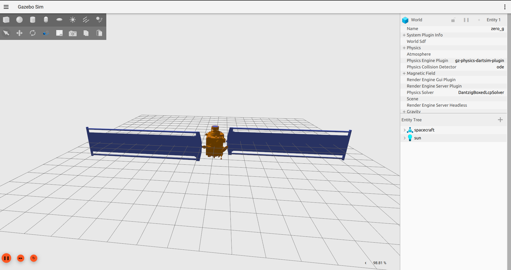
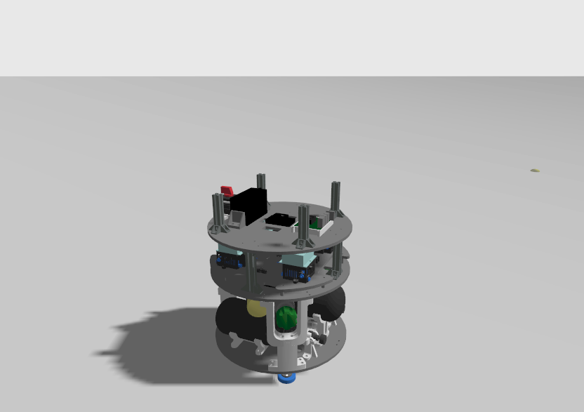

\page spacecraft_thrusters Spacecraft thrusters

## Spacecraft Thrusters Model

To enable a seamless transition of space robotics control and planning schemes from simulation to real, we introduce
a spacecraft thrusters model in Gazebo. The model provides a very simple interface to a solenoid valve that controls
the flow of gas to the thruster. The thruster model is as follows:

- force output equals max_thrust when the command is 1
- force output equals 0 when the command is 0
- force output is modeled according to a duty cycle with a given frequency, and thrust output is maximum at the ON state of the duty cycle

In short, if the duty cycle signal is high, the solenoid valve behaves as a fully-opened thruster, providing maximum thrust.
If the duty cycle signal is low, the solenoid valve behaves as a fully-closed thruster, providing no thrust.

## Setting up the SpacecraftThrusterModel plugin

Here follows an example instance of the `SpacecraftThrusterModel` plugin in an SDF file:
```xml
    <plugin filename="gz-sim-spacecraft-thruster-model-system" name="gz::sim::systems::SpacecraftThrusterModel">
      <link_name>thruster_0</link_name>
      <actuator_number>0</actuator_number>
      <duty_cycle_frequency>10</duty_cycle_frequency>
      <max_thrust>1.4</max_thrust>
      <sub_topic>command/duty_cycle</sub_topic>
    </plugin>
```

In this case, each thruster link should be placed in the proper location in the spacecraft model.
An example of this goes below:
```xml
<joint name='thruster_0_joint' type='fixed'>
      <pose relative_to='base_link'>-0.12 0.12 0.2 3.14159 1.57079 3.14159</pose>
      <parent>base_link</parent>
      <child>thruster_0</child>
      <axis>
        <dynamics>
          <spring_reference>0</spring_reference>
          <spring_stiffness>0</spring_stiffness>
        </dynamics>
        <xyz>0 0 1</xyz>
        <limit>
          <lower>-1e+16</lower>
          <upper>1e+16</upper>
        </limit>
      </axis>
      <physics>
        <ode>
          <limit>
            <cfm>0</cfm>
            <erp>0.2</erp>
          </limit>
        </ode>
      </physics>
    </joint>
    <link name='thruster_0'>
      <gravity>true</gravity>
      <pose relative_to='thruster_0_joint'>0 0 0 0 -0 0</pose>
      <inertial>
        <pose>0 0 0 0 0 0</pose>
        <mass>0.001</mass>
        <inertia>
          <ixx>1e-05</ixx>
          <ixy>0</ixy>
          <ixz>0</ixz>
          <iyy>1e-05</iyy>
          <iyz>0</iyz>
          <izz>1e-05</izz>
        </inertia>
      </inertial>
    </link>
```

## Testing an implementation of a Spacecraft model
An example of a spacecraft with thrusters is implemented in the [DART spacecraft model](https://app.gazebosim.org/proque/fuel/models/dart). To run the example, run the following command:
```bash
gz sim spacecraft.sdf
```

This spacecraft has 12 thrusters. To send inputs to `thruster_0`, run the following command:
```bash
gz topic -p 'normalized:[1.0, 0.0, 0.0, 0.0, 0.0, 0.0, 0.0, 0.0, 0.0, 0.0, 0.0, 0.0]' -t /dart/command/duty_cycle --msgtype gz.msgs.Actuators
```

This command will send the maximum force of a thruster over one sampling time.

Below, an image of the spacecraft:


## 2D Spacecraft Simulator - Ground Space Robotics testbed

An example of a ground testbed for spacecrafts is also available, where the spacecraft moves a 2D plane using thrusters. The testbed spacecraft model has 8 thrusters, and the thrusters are controlled by the `SpacecraftThrusterModel` plugin. This replicates the real [DISCOWER](https://www.discower.io/) testbed at KTH Space Robotics Laboratory in Stockholm Sweden.

To run this example, run the following command:
```bash
gz sim ground_spacecraft_testbed.sdf
```

This spacecraft has 8 thrusters. To send inputs to `thruster_0`, run the following command:
```bash
gz topic -p 'normalized:[1.0, 0.0, 0.0, 0.0, 0.0, 0.0, 0.0, 0.0, 0.0, 0.0, 0.0, 0.0]' -t /kth_freeflyer/command/duty_cycle --msgtype gz.msgs.Actuators
```

Below is a picture of the simulator:

